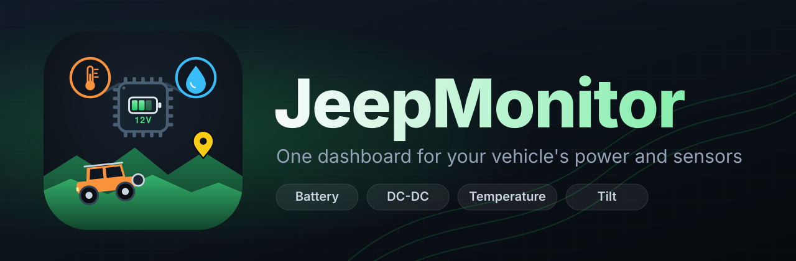

<p align="center">
  
</p>

<p align="center">
  Renogy Smart Shunt, Renogy DC-DC charger, a Bluetooth thermometer and the tablet's own tilt sensor, side by side on one dashboard you arrange yourself.
</p>

---

## What it is

JeepMonitor is a React Native (Expo) app for Android phones and tablets. It talks to the Renogy gear in a Jeep over
Bluetooth Low Energy and shows it as a dashboard you arrange yourself, like Android home-screen widgets. It exists
because the vendor app shows one device at a time and is slow to use in a vehicle.

## Features

- **Battery at a glance**: state of charge, voltage, current, power, temperature and a time-remaining estimate from
  a Renogy Smart Shunt 300.
- **DC-DC charger**: alternator and solar volts and amps, temperatures, charging state, today's and lifetime energy,
  protection counters (Renogy BT-1 / BT-2 Modbus).
- **Thermometer**: temperature, humidity, dew point and sensor battery from a Xiaomi LYWSD03MMC with custom firmware.
  Read from BLE advertisements, so there is no connection to keep alive.
- **Clinometer**: pitch and roll from the tablet's motion sensor. Knows whether the tablet lies flat or stands upright,
  "Set level here" to zero it, bubble, vehicle and numbers styles, fullscreen.
- **Your own picture** widget for a logo or emblem.
- **Free-form dashboard**: hold a widget to edit, drag to move, drag the corner to resize. Content scales with the
  widget. Graph type (bars, line, area, off), names and labels are set per widget.
- **Refresh / disconnect / connect** on every device widget, and a fullscreen mode for the whole dashboard.
- **GATT explorer** for inspecting devices that have no known protocol yet.

## Supported devices

| Device | How it connects | Status |
|---|---|---|
| Renogy Smart Shunt 300 | BLE notifications | Works |
| Xiaomi LYWSD03MMC (pvvx / ATC firmware) | BLE advertisements | Works |
| Renogy controller / DC-DC charger with a BT-1 or BT-2 module | Modbus over BLE | Experimental |
| Renogy ONE Core | Unknown protocol | Not supported yet (use the Explorer tab to capture it) |

A DC-DC charger that is wired to a ONE Core over RS485 has no Bluetooth of its own and is only reachable through the
ONE Core.

## Build and install

You need Node 20 or newer, the Android SDK (Android Studio) and a **JDK 17**. Android Studio's bundled JDK 25 breaks
the native CMake step, so point `JAVA_HOME` at a 17.

```bash
git clone https://github.com/jaba0x/JeepMonitor.git
cd JeepMonitor
npm install
npx expo prebuild --platform android
cd android && ./gradlew assembleRelease
adb install -r app/build/outputs/apk/release/app-release.apk
```

Bluetooth does not work in Expo Go, which is why this is a development build with native modules.

```bash
npm run typecheck   # tsc
npm test            # vitest: protocol parsers, tilt maths, grid layout
```

## Project layout

```
App.tsx                 tabs, header, fullscreen
src/ble/                BLE sessions and the driver registry (add new devices here)
src/protocol/           pure parsers: shunt, Renogy Modbus, thermometer, tilt (unit tested)
src/state/              device list, readings and history
src/ui/                 dashboard grid, widgets, settings
assets/                 logo and app icons
scripts/bump.mjs        version bump helper
```

To support a new device: add a parser in `src/protocol`, a `BleSession` subclass in `src/ble`, register it in
`src/ble/registry.ts` and add a body for it in `src/ui/DeviceCard.tsx`.

## Versioning and releases

Semantic versioning, one annotated tag per release (`v0.4.0`), notes in [CHANGELOG.md](CHANGELOG.md). The version is
shown on the About screen. The Android `versionCode` is `major * 10000 + minor * 100 + patch`.

```bash
npm run bump -- minor        # or patch / major / x.y.z: updates package.json and app.json
# edit CHANGELOG.md
git commit -am "Release v0.5.0"
git tag -a v0.5.0 -m "v0.5.0"
git push --follow-tags
```

## Disclaimer

JeepMonitor is an independent project. It is not affiliated with or endorsed by Renogy, Xiaomi, Jeep or Stellantis. All
product names and trademarks belong to their owners. Use it at your own risk and do not rely on it for safety
decisions.

## Author

[Jaba Macharashvili](https://clihero.com) | [clihero.com](https://clihero.com)

## License

[MIT](LICENSE)
